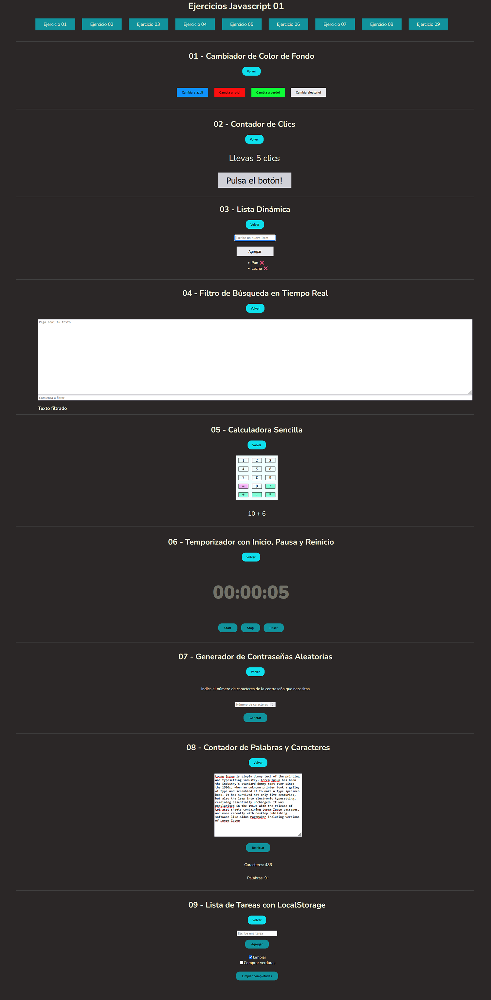

<h1 align="center" style="color: #0366d6;">
   JAVASCRIPT-EJERCICIOS-JAVASCRIPT
</h1>

Repositorio con diferentes ejercicios realizados en Javascript.

## Descripción 📝

Proyecto realizado con HTML, CSS, SASS y JAVASCRIPT para entender la lógica de programación.

## Vista previa en vivo 👀
Puedes ver los ejercicios funcionando aquí:  
🔗 [https://oconcejero.github.io/JAVASCRIPT-EJERCICIOS_JAVASCRIPT/](https://oconcejero.github.io/JAVASCRIPT-EJERCICIOS_JAVASCRIPT/)

Puedes ver una vista previa en vivo de los juegos. 
